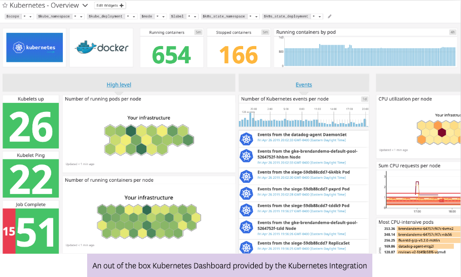

# 1. Introduction to Kubernetes Monitoring

In the Introduction to Monitoring Kubernetes course on the Datadog Learning Platform, you will learn all the basics about monitoring the Kubernetes platform.

We will start installing the Datadog Agent. From there we talk about tagging and how important it is to come up with a good set of tags to describe your various workloads. Next, we look at the different metrics you want to keep an eye on to ensure Kubernetes is working properly. After that, we look at how collecting logs and APM traces is different with Kubernetes. Finally, we tackle monitoring your applications on the platform.

 # 2. Adding thr Datadog Agent to Kubernetes

  ## Install the Datadog Agent

 # 3. Working with Logs on Kubernetes

  ## Logs on Kubernetes

 # 4. Importance of Tags

  ## Tagging

 # 5. APM on Kubernetes

  ## APM on Kubernetes

 # 6. Monitoring Kubernetes  

  ## Kubernetes Platform Metrics

 # 7. Monitoting Your Applciaitons on Kubernetes 
  
  ## Monitoring Kubernetes Applications
